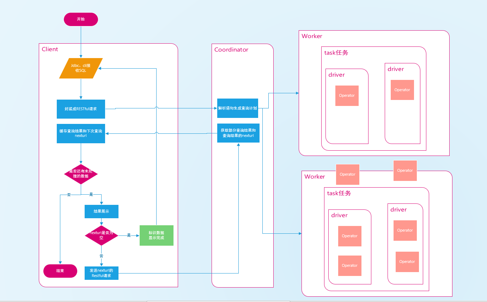

提交查询
========

|     终端用户可以用过jdbc或者cli提交查询语句，也可以通过第三方机构或者个人使用python、c语言开发的驱动提交查询。presto客户端对查询语句的提交主要分为三个步骤。

- 从指定的文件、命令行参数或者cli窗口中获取需要执行的sql语句。
- 将得到的sql语句组装成一个RESTful请求，发送给Coordinator，并处理返回的response。
- cli会不停的循环分批读取查询结果并在屏幕进行动态展示，直到查询结果完全显示完毕。

| 查询流程图

