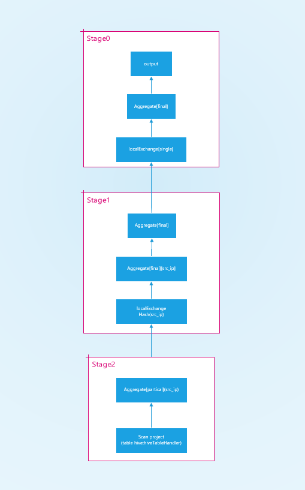

生成查询计划
============

|     本章主要讲述presto对一个传入的sql语句如何进行解析并生成最终的执行计划。

.. image:: presto-create-query.png

|     从上图可以看到，生成查询计划分成语法分析、词法分析、语义分析、执行计划生成、执行计划优化、执行计划分阶段执行。

基本概念
>>>>>>>>

node
::::

查询语句经过词法和语法分析之后，会生成抽象语法树(AST)，该语法树中的每一个几点都是一个Node(SQL语句的一部分，如select、where、group by等)。Node是一个抽象类，实现类如下:

#. approximate 用于近似查询
#. explainOption 标识explain语句的可选参数，有explainFormat和explainType两类。explainFormat标识输出结果的格式，有text和graphviz两种类型。explainType标识explain语句的类型，有logical和distributed两类，分别标识生成逻辑执行计划与生成分布式执行计划。
#. expression 标识sql语句中出现的表达式。
#. framebound 用于窗口函数中华东窗口的可选参数。
#. relation 是一个抽象类，标识多个节点之间的关系，如join、union等。
#. select 标识查询语句中的select部分。
#. selectitem 标识select语句中的列类型，有allcolumns和singlecolumns两种类型。
#. sortitem 标识排序的某一列及其类型。
#. statement 标识presto能使用的sql类型的sql语句。
#. tableelement 标识建表语句描述表的每一列，包括列名与类型。
#. window 表示一个窗口函数。
#. windowFrame 表示窗口函数中欢动窗口的可选参数。
#. with 表示一个查询中所有的with语句，主要元素有recursive、querys。
#. withquery 表示一个with语句，主要元素有name、query、columnNames。

metadata API
::::::::::::

| metadata API即是matadata接口，其提供了对源数据进行各种操作的接口，列如列出所有的数据库名、表名等。这些接口在对sql进行语义分宜以及某些ddl操作(如create table)的执行过程中会用到。
| metadata api将不同Connector对其元数据的各种啊哦做抽象成一了统一的接口，使得在使用这些接口时无需考虑具体的底层connector实现。
| metadata api除了提供对元数据操作的接口，还提供了一些通用的与connector无关的方法，例如列出presto支持的自定义函数等。

词法和语法分析
>>>>>>>>>>>>>>

|     presto的此法于语法分析是封装在SQLQuerymanager的createQuery方法中。

语法规则
::::::::

presto使用ANTLR4编写sql语法，语法规则的定义在presto-parse项目的sqlbase.g4文件中，通过ANTLR4查看该文件的语法图。

词法分析
::::::::

SQLParse的createStatement方法调用其内部方法invokeParser。

语法分析
::::::::

presto使用visitor模式对sql语句进行语法分析。

获取查询执行引擎
>>>>>>>>>>>>>>>>

queryexecution表示一次查询执行，用于启动、停止与管理一个查询，以及统计这个查询的相关信息。

获取queryExecutionFactory
:::::::::::::::::::::::::

根据statement类型获取相对应的QueryExecutionFactory。QueryExecutionFactory是一个借口，其实现类有DataDefinitionExecutionFactory以及SqlQueryExecutionFactory。
executionFactories则是一个Map，存储了不同的Statement类型与QueryExecutionFactory实现类的对应关系，该map的初始化实在CoordinatorModule中进行的，对应关系如表：

+------------------------------------------+----------------------------------------------+
| Statement实现类                          | QueryExecutionFactory实现类                  |
+==========================================+==============================================+
| createTable                              |                                              |
+------------------------------------------+                                              |
| RenameTable                              |                                              |
+------------------------------------------+                                              |
| RenameColumn                             |                                              |
+------------------------------------------+                                              |
| DropTable                                |          DataDefinitionExecutionFactory      |
+------------------------------------------+                                              |
| CreateView                               |                                              |
+------------------------------------------+                                              |
| SetSession                               |                                              |
+------------------------------------------+                                              |
| ResetSession                             |                                              |
+------------------------------------------+----------------------------------------------+
| Query                                    |                                              |
+------------------------------------------+                                              |
| Explain                                  |                                              |
+------------------------------------------+                                              |
| showColumns                              |                                              |
+------------------------------------------+                                              |
| showPartitions                           |                                              |
+------------------------------------------+                                              |
| showFunctions                            |                                              |
+------------------------------------------+                                              |
| showTables                               |                                              |
+------------------------------------------+                                              |
| showSchemas                              |              SqlQueryExecutionFactory        |
+------------------------------------------+                                              |
| showCatalogs                             |                                              |
+------------------------------------------+                                              |
| user                                     |                                              |
+------------------------------------------+                                              |
| showSessions                             |                                              |
+------------------------------------------+                                              |
| createTableAsSelect                      |                                              |
+------------------------------------------+                                              |
| insert                                   |                                              |
+------------------------------------------+                                              |
| Delete                                   |                                              |
+------------------------------------------+----------------------------------------------+

create table 、rename table 等ddl操作的sql语句对应了DataDefinitionExecutionFactory，而非ddl操作的sql语句。例如select、insert等对应了SqlQueryExecutionFactory。

创建QueryExecution
::::::::::::::::::

| 当以上的词法与语法分析出错，照着找不到statement实现类与QueryExecutionFactory实现类的对应关系时，将创建一个FailedQueryExecution，冰封装错误信息，最后返回给用户。
| 调用之前获取的QueryExecutionFactory的createQueryExecution方法，获取对应的QueryExecution。DataDefinitionExecutionFactory创建的是DataDefinitionExecution，而
| SqlQueryExecutionFactory创建的是SqlQueryExecution。
| 在DataDefinitionExecutionFactory创建DataDefinitionExecution时，根据statement类型将对应的DataDefinitionExecutionTask实现类与DataDefinitionExecution绑定。

启动QueryExecution
::::::::::::::::::

获取QueryExecution之后，SqlQueryQueueManager方法将QueryExecution与配置的查询队列规则进行匹配，如匹配成功且队列未满，则将QueryExecution加入匹配队列。查询队列按照
FIFO规则调度查询。最后启动QueryExecution。
DataDefinitionExecution启动直接调用其绑定的DataDefinitionTask实现类的execute方法即可。以dropTable为例，由于DropTable与dropTableTask绑定，会华之杰执行DropTableTask
的execute方法。
SqlQueryExecution启动比较复杂，需要执行查询计划、优化查询计划、分阶段执行查询计划。

语义分析
>>>>>>>>

由于DataDefinitionExecution的执行直接调用DataDefinitionTask实现类的execute方法，并未经过执行计划生成的步骤，故以下的内容只针对SqlQueryExecutionFactory。

statement分析
:::::::::::::

statementAnalyzer是对statement进行予以分析的类，针对不同的statement实现类进行语义分析。

relation分析
::::::::::::

TupleAnalyzer类是对Query中的Relation进行分析的类。

表达式分析
::::::::::

ExpressionAnalyzer类对sql语句中的表达式进行分析，主要功能如下:

#. 获取表达式的类型
#. 获取需要进行类型转换的表达式及其转换的目的类型。
#. 获取表达式中存在的函数信息。
#. 获取表达式中所有合法的列名及对应列的编号。
#. 获取表达式中In语句中的子查询。

执行计划生成
>>>>>>>>>>>>

LogicalPlanner类会根据以上针对SQL语句分析所得的结果，生成逻辑执行计划。

执行计划节点
::::::::::::

在讲解执行计划生成之前，首先介绍一下执行计划树中的节点类型。

#. AggregationNode 是用于聚合操作的节点，聚合的类型有Final、Partial、Single三种，分别表示最终聚合、局部聚合和单店聚合，其中执行计划在进行优化之前，聚合的类型都是单点聚合，在执行计划优化器中会对其进行拆分成局部聚合和最终聚合。
#. DeleteNode 是用于Delete操作的节点。
#. DistinctLimitNode 是用于处理以下类型的sql语句的节点。
#. ExchangeNode 是用于在执行计划中不同stage之间交换数据的节点，出现在逻辑执行计划中。
#. FilterNode 是用国语进行过滤操作的节点
#. IndexJoinNode 是用于对Index Join操作的节点。
#. IndexSorceNode 是与Index join配合使用的执行数据源读取操作的节点。
#. JoinNode 是执行Join操作的节点
#. LimitNode 是执行limit操作的及诶单
#. MarkDistinctNode 是用于处理一下outputNode、projectNode的sql语句的节点。
#. OutputNode 输出最终结果的节点
#. project 用于进行列映射的及诶单，用于将ProjectNode下层节点输出的列映射到Project上层节点输入的列。
#. RemoteSourceNode 类似于ExchangeNode，用于分布式执行计划中不同的stage之间交换数据，出现在分布式执行计划中。
#. RowNumberNode 用于处理窗口函数row_number
#. SampleNode 用于处理抽样函数
#. SemiJoinnode 用于处理执行计划生成过程中产生的SemiJoin。
#. SortNode 用于排序操作。
#. TableCommitNode 用于对create table as select语句、insert语句、delete语句的操作执行commit。
#. TableScanNode 用于读取表的数据。
#. TableWriterNode 用于向目的的表写入数据。
#. TopNNode 用于取数据排序后的前N条结果，使用效率更高的TopN算法，而不是对所有数据进行全局派去在取前N条，TopN问题与算法不在具体详述。
#. TopNRowNumberNode 用于处理窗口函数row_number中排序前N条记录，使用效率更高的TopN算法。
#. UnionNode 用于处理Union操作
#. UnnestNode 用于处理Unnest操作
#. ValuesNode 用于处理Values语句。
#. WindowNode 用于处理窗口函数。

sql执行计划
:::::::::::

LogicalPlanner负责整个sql语句执行计划的生成，根据sql语句的类型生成不同的执行计划，然后针对生成的执行计划，分别使用已注册的执行计划优化器进行优化。

1. TableWriter Plan

crate table as select 语句和insert语句都会生成tablewriterplan，其所生成的执行计划树如下。

其中queryplan是指create table as select语句或insert语句后面的查询语句生成的执行计划树，在tablewriternode和outputnode之间添加tablecommitnode可以防止数据写入失败导致的中间状态，
但确保数据写入成功之后再进行commit操作。

2. Deleteplan

Delete语句生成DeletePlan，其执行进化树结果如图。

3. queryplan

所有热拉提欧尼类型的sql语句都会生成queryplan，由下一节中的relationPlanner分析并生成查询执行计划。

relation执行计划
::::::::::::::::

RelationPlanner用于针对Relation类型的sql语句生成执行计划。

1、table

visitTable对table进行分析主要分为以下两步。如果该table是with所定义的表明，或者该table实际是一个view，则处理其所关联的查询生成执行计划。如果该table是普通的表，则构建TableScanNode。

2、AliasedRelation

visitAliasedRelation处理AliasedRelation所关联的relation，并生成执行计划。

3、SampledRelation

visitSampledRelation处理SampledRelation分为处理其关联的relation，生成执行计划树。构建一个sampleNode，添加到以上的执行计划树之上。

4、join

visitjoin处理join分为处理join左侧的relation，生成左侧执行计划树。如果join右侧是unnest且join类型为cross join或者Implicit join，则根据unnest构造一个UnnestNode以及一个ProjectNode，添加到左侧
执行计划树智商并返回。

query执行计划
:::::::::::::

queryplanner用于处理query和querySpecification。

执行计划优化
>>>>>>>>>>>>

生成执行计划之后，会对所生成的执行计划进行优化，目前presto只支持基于规则的优化器。现有的优化器包括如下几种。

ImplementSampleAsFilter
:::::::::::::::::::::::
将bernoulli抽样的samplenode改写为filternode，filternode的过滤条件为 rand() < SampleRatio

CannonicalizeExpressions
::::::::::::::::::::::::
将执行计划中设计的表达式进行标准化，标准化的主要工作有。

::

    is not null 改写为 not(is null)
    if 语句改写为case when语句
    处理时间函数

SimplifyExpressions
:::::::::::::::::::
对执行计划中设计的表达式进行简化和优化处理，具体可查看ExpressionInterpreter。

UnaliaseSymbolReferences
::::::::::::::::::::::::

用于去除执行计划中projectnode中的无异议映射。

UnaliaseSymbolReferences
::::::::::::::::::::::::
用于去除执行计划中projectnode中的无意义映射。

执行计划分段
>>>>>>>>>>>>

经过执行计划生成与执行计划优化之后，最后对执行计划进行分段。

source
::::::
source阶段是从数据源的表中读取数据的阶段，一般包括tableScanNode和projectNode，以及可能存在的filterNode等。

fixed
:::::
fixed阶段位于source阶段之后，该阶段将source阶段读取的数据分散到多个节点上进行处理，主要处理的操作有局部聚合、局部join、局部数据写入表等。

single
::::::

single阶段位于fixed阶段之后，只在单个节点上执行，用于汇总所有的处理结果，例如针对局部聚合的数据进行最终聚合，并将结果传输给coordinator。

Coordinator_only
::::::::::::::::

Coordinator_only阶段只在coordinator上执行，对insert和create table操作进行commit的tableCommitNode属于Coordinator_only阶段。

查询计划执行
>>>>>>>>>>>>

count执行计划
:::::::::::::

::

    presto:test> explain (type distributed) select count(distinct src_ip) from t_ods_industry_atd;
                                                                                           Query Plan
    ---------------------------------------------------------------------------------------------------------------
     Fragment 0 [SINGLE]
         Output layout: [count]
         Output partitioning: SINGLE []
         Stage Execution Strategy: UNGROUPED_EXECUTION
         - Output[_col0] => [[count]]
                 Cost: ?, Output: ? rows (?B)
                 _col0 := count
             - Aggregate(FINAL) => [[count]]
                     Cost: ?, Output: ? rows (?B)
                     count := "count"("count_4")
                 - LocalExchange[SINGLE] () => [[count_4]]
                         Cost: ?, Output: ? rows (?B)
                     - RemoteSource[1] => [[count_4]]
                             Cost: ?, Output: ? rows (?B)

     Fragment 1 [HASH]
         Output layout: [count_4]
         Output partitioning: SINGLE []
         Stage Execution Strategy: UNGROUPED_EXECUTION
         - Aggregate(PARTIAL) => [[count_4]]
                 Cost: ?, Output: ? rows (?B)
                 count_4 := "count"("src_ip")
             - Aggregate(FINAL)[src_ip][$hashvalue] => [[src_ip, $hashvalue]]
                     Cost: ?, Output: ? rows (?B)
                 - LocalExchange[HASH][$hashvalue] ("src_ip") => [[src_ip, $hashvalue]]
                         Cost: ?, Output: ? rows (?B)
                     - RemoteSource[2] => [[src_ip, $hashvalue_5]]
                             Cost: ?, Output: ? rows (?B)

     Fragment 2 [SOURCE]
         Output layout: [src_ip, $hashvalue_6]
         Output partitioning: HASH [src_ip][$hashvalue_6]
         Stage Execution Strategy: UNGROUPED_EXECUTION
         - Aggregate(PARTIAL)[src_ip][$hashvalue_6] => [[src_ip, $hashvalue_6]]
                 Cost: ?, Output: ? rows (?B)
             - ScanProject[table = hive:HiveTableHandle{schemaName=test, tableName=t_ods_industry_atd, analyzeParti
                     Estimates: {rows: ? (?), cpu: ?, memory: 0.00, network: 0.00}/{rows: ? (?), cpu: ?, memory: 0.
                     Cost: ?, Output: ? rows (?B)
                     $hashvalue_6 := "combine_hash"(bigint '0', COALESCE("$operator$hash_code"("src_ip"), 0))
                     LAYOUT: test.t_ods_industry_atd
                     src_ip := src_ip:string:20:REGULAR
                     event_type_id:string:-1:PARTITION_KEY
                         :: [[1], [2], [3], [6], [8]]
                     ds:string:-1:PARTITION_KEY
                         :: [[2019-06-26], [2019-07-17]]

    (1 row)

    Query 20190830_091640_00070_rewpf, FINISHED, 1 node
    Splits: 1 total, 1 done (100.00%)
    0:06 [0 rows, 0B] [0 rows/s, 0B/s]

join执行计划
::::::::::::

::

    presto:test> explain (type distributed)  select device.service,count(1) counter from postgres.public.tb_protocol_device device left join hive.test.t_ods_industry_atd atd on (device.service=atd.dst_service) group by device.service order by counter desc limit 10;
                                                                                             Query Plan
    ---------------------------------------------------------------------------------------------------------------
     Fragment 0 [SINGLE]
         Output layout: [service, count]
         Output partitioning: SINGLE []
         Stage Execution Strategy: UNGROUPED_EXECUTION
         - Output[service, counter] => [[service, count]]
                 Cost: ?, Output: ? rows (?B)
                 counter := count
             - TopN[10 by (count DESC_NULLS_LAST)] => [[service, count]]
                     Cost: ?, Output: ? rows (?B)
                 - LocalExchange[SINGLE] () => [[service, count]]
                         Cost: ?, Output: ? rows (?B)
                     - RemoteSource[1] => [[service, count]]
                             Cost: ?, Output: ? rows (?B)

     Fragment 1 [HASH]
         Output layout: [service, count]
         Output partitioning: SINGLE []
         Stage Execution Strategy: UNGROUPED_EXECUTION
         - TopNPartial[10 by (count DESC_NULLS_LAST)] => [[service, count]]
                 Cost: ?, Output: ? rows (?B)
             - Project[] => [[service, count]]
                     Cost: ?, Output: ? rows (?B)
                 - Aggregate(FINAL)[service][$hashvalue] => [[service, $hashvalue, count]]
                         Cost: ?, Output: ? rows (?B)
                         count := "count"("count_12")
                     - LocalExchange[HASH][$hashvalue] ("service") => [[service, count_12, $hashvalue]]
                             Cost: ?, Output: ? rows (?B)
                         - RemoteSource[2] => [[service, count_12, $hashvalue_13]]
                                 Cost: ?, Output: ? rows (?B)

     Fragment 2 [HASH]
         Output layout: [service, count_12, $hashvalue_19]
         Output partitioning: HASH [service][$hashvalue_19]
         Stage Execution Strategy: UNGROUPED_EXECUTION
         - Aggregate(PARTIAL)[service][$hashvalue_19] => [[service, $hashvalue_19, count_12]]
                 Cost: ?, Output: ? rows (?B)
                 count_12 := "count"(*)
             - Project[] => [[service, $hashvalue_19]]
                     Cost: ?, Output: ? rows (?B)
                     $hashvalue_19 := "combine_hash"(bigint '0', COALESCE("$operator$hash_code"("service"), 0))
                 - LeftJoin[("expr" = "dst_service")][$hashvalue_14, $hashvalue_16] => [[service]]
                         Cost: ?, Output: ? rows (?B)
                         Distribution: PARTITIONED
                     - RemoteSource[3] => [[service, expr, $hashvalue_14]]
                             Cost: ?, Output: ? rows (?B)
                     - LocalExchange[HASH][$hashvalue_16] ("dst_service") => [[dst_service, $hashvalue_16]]
                             Estimates: {rows: ? (?), cpu: ?, memory: 0.00, network: ?}
                             Cost: ?, Output: ? rows (?B)
                         - RemoteSource[4] => [[dst_service, $hashvalue_17]]
                                 Cost: ?, Output: ? rows (?B)

     Fragment 3 [SOURCE]
         Output layout: [service, expr, $hashvalue_15]
         Output partitioning: HASH [expr][$hashvalue_15]
         Stage Execution Strategy: UNGROUPED_EXECUTION
         - Project[] => [[service, expr, $hashvalue_15]]
                 Estimates: {rows: ? (?), cpu: ?, memory: 0.00, network: 0.00}
                 Cost: ?, Output: ? rows (?B)
                 $hashvalue_15 := "combine_hash"(bigint '0', COALESCE("$operator$hash_code"("expr"), 0))
             - ScanProject[table = postgres:postgres:public.tb_protocol_device:null:public:tb_protocol_device, grou
                     Estimates: {rows: ? (?), cpu: ?, memory: 0.00, network: 0.00}/{rows: ? (?), cpu: ?, memory: 0.
                     Cost: ?, Output: ? rows (?B)
                     expr := CAST("service" AS varchar)
                     service := JdbcColumnHandle{connectorId=postgres, columnName=service, jdbcTypeHandle=JdbcTypeH

     Fragment 4 [SOURCE]
         Output layout: [dst_service, $hashvalue_18]
         Output partitioning: HASH [dst_service][$hashvalue_18]
         Stage Execution Strategy: UNGROUPED_EXECUTION
         - ScanProject[table = hive:HiveTableHandle{schemaName=test, tableName=t_ods_industry_atd, analyzePartition
                 Estimates: {rows: ? (?), cpu: ?, memory: 0.00, network: 0.00}/{rows: ? (?), cpu: ?, memory: 0.00,
                 Cost: ?, Output: ? rows (?B)
                 $hashvalue_18 := "combine_hash"(bigint '0', COALESCE("$operator$hash_code"("dst_service"), 0))
                 LAYOUT: test.t_ods_industry_atd
                 dst_service := dst_service:string:25:REGULAR
                 event_type_id:string:-1:PARTITION_KEY
                     :: [[1], [2], [3], [6], [8]]
                 ds:string:-1:PARTITION_KEY
                     :: [[2019-06-26], [2019-07-17]]

    (1 row)

    Query 20190830_092059_00071_rewpf, FINISHED, 1 node
    Splits: 1 total, 1 done (100.00%)
    0:07 [0 rows, 0B] [0 rows/s, 0B/s]

