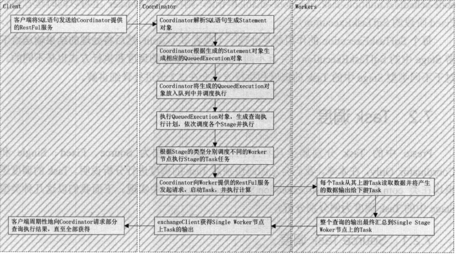
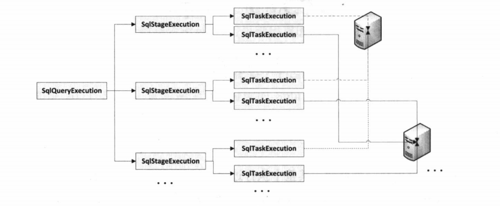

执行查询
========

向presto集群提交查询，整个执行过程会尽力以下4个阶段。

- 提交查询 客户端向coordinator提供的restful服务提交sql语句。
- 生成查询执行计划。coordinator根据传递的sql语句生成对应的查询执行计划。
- 查询调度。coordinator会调度最空闲的worker执行相应的task进行实际的计算任务。

查询执行逻辑
>>>>>>>>>>>>

presto中的所有查询会一次转化为SqlQueryExecution、SqlStageExecution和SqlTaskExecution，因此所有的查询最终都会转化支撑位一个个单独的Task在每个Worker节点上执行。

一个SqlQueryExecution可以被分解成多个SqlStageExecution，而一个SqlStageExecution可以被分解成多个SqlTaskExecution，每个SqlTaskExecution运行在一个Worker上，并且在一个
Worker上运行的属于同一个SqlStageExecution的SqlTaskExecution个数不能多于一个（如果设置node-scheduler。multiple-tasks-per-node-enable=true，则在一个worker上可以同时
运行多个Fixed阶段的SqlTaskExecution）。

每个SqlTaskExecution的作用就是处理一个或者多个split，然后将处理的结果输送给下游Stage中的SqlTaskExecution，并且不同Stage中的Task的调度和执行方式也是不同的。

task调度
>>>>>>>>

presto中的Task分别属于几种不同的Stage，分别为Source、Fixed、Single和Coordinator_only。Task的调度逻辑在SqlStageExecution中实现。

source task调度
:::::::::::::::

presto可以读取多种数据源中的数据，然后在内存中进行计算。presto就是通过Source Stage从各种各样的数据源中读取数据的，属于source stage的Task
我们称之为Source Task，Source Task的执行逻辑如下。

- 根据Split的本地行，生成Node与Split的对应关系。
- 根据Node与Split的对应关系，在指定的Node上启动Source Task处理位于该Node上的Splits。

fixed task调度
::::::::::::::

属于Fixed Stage的Task我们称之为Fixed Task。从前面的章节可以得知：在Fixed Stage中会将Join操作两边的数据集分别分解成 initial-hash-partitions个数的数据自己，然后将Hash值相等的
行分布到相同的worker上进行join计算。这样就相当于以initial-hash-partitions倍的并行度进行计算，从而极大的提高了Fixed Stage的计算性能。
运行在每个Worker上的Fixed Task的任务就是贱hash过来的数据进行join操作，然后将结果输出给校友Stage。

single task调度
:::::::::::::::

属于Single Stage的Task我们称之为Single Task。在Single Stage中会将其上游Stage的所有输出汇集到一个Worker
节点上进行汇总计算。运行在Worker上的Single Task的任务就是将其从上游Stage中所有Task产生的数据汇总计算，然后将结果输出给
Coordinator，最后再由Coordinator输出给客户端。Single Task的典型使用场景就是全局排序，在进行全局排序计算的时候，是在Single Stage中完成
的。在进行计算之前会将其上游Stage的输出全部都汇集到Single Node上，然后在Single Node上运行Single Task回见汇聚到的数据进行全局排序。

coordinator_only task调度
:::::::::::::::::::::::::

当执行DDL或者DML语句的时候，只需要在presto的coordinator对元数据进行添加或者更改。另外，但执行create table as select语句的时候，将会产生两个stage，分别是source stage和coordinator_only
 stage,其中source stage负责从表中查询语句并将数据写入表对应的路径下。coordinator_only stage负责根据查询语句创建元数据。

task执行
>>>>>>>>

从前面的章节中我们了解到task的调度过程，无论是哪种类型的task，最终都需要调用方法创建task，或者调用方法更新task。

创建task
::::::::

更新task
::::::::

运行task
::::::::
